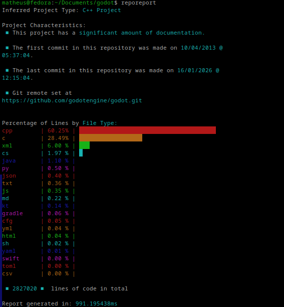

# reporeport


Fast AI-free repository analysis tool that counts files and lines by type, infers project type, and provides a concise summary report.

## Features

- Counts files and lines for common extensions, excluding vendor/lib folders by default
- Infers project type from dominant languages and presence of package manifests (Go, Python, Java, React/TSX, TypeScript, generic fallback)
- Shows percentage breakdown of lines by file type plus total elapsed time
- Optional flag to include `node_modules`, `vendor`, `.venv`, etc. in the report
- Cross-platform: simple build script for Linux and a Windows build helper

## Install

### Linux

```sh
sudo curl -sSL https://github.com/mathealgou/reporeport/releases/latest/download/reporeport -o /usr/local/bin/reporeport && sudo chmod +x /usr/local/bin/reporeport
```

### Windows

```powershell
Invoke-WebRequest -Uri "https://github.com/mathealgou/reporeport/releases/latest/download/reporeport.exe" -OutFile "C:\Windows\System32\reporeport.exe"
```

### Pre-built binaries:

Download the latest release from the [Releases](https://github.com/mathealgou/reporeport/releases)

### Clone and build locally:

Requirements: Go 1.25+

```sh
git clone https://github.com/mathealgou/reporeport.git
cd reporeport
go build -o reporeport main.go
```

Linux helper script (moves binary to `/usr/bin`, requires sudo):

```sh
chmod +x build.sh
./build.sh
```

Windows build (drops `dist/reporeport.exe`, requires Bash):

```sh
chmod +x build-windows.sh
./build-windows.sh
```

## Usage

From the repo root (or after placing the binary on your PATH):

```sh
reporeport [--include-libs]
```

Flags currently supported in code:

- `--help`: show CLI help
- `--include-libs`: count files inside lib/vendor/node_modules/.venv, etc.
- `--use-gitignore`: respect `.gitignore` rules when scanning files, skipping ignored files and directories.
- `--verbose`: Output the processing and analysis steps to the console (may slow down execution due to I/O overheard).
- `--no-collor`: Print the report in black and white.

## Example output



```bash
$ reporeport
Inferred Project Type: C++ Project

Project Characteristics:
 ■ This project has a significant amount of documentation.

 ■ The first commit in this repository was made on 10/04/2013 @
05:37:04.

 ■ The last commit in this repository was made on 16/01/2026 @
12:15:04.

 ■ Git remote set at
https://github.com/godotengine/godot.git


Percentage of Lines by File Type:
cpp        | 60.25% | ███████████████████████████████████████
c          | 28.49% | ██████████████████
xml        | 6.00 % | ███
cs         | 1.97 % | █
java       | 1.10 % |
py         | 0.50 % |
json       | 0.40 % |
txt        | 0.36 % |
js         | 0.35 % |
md         | 0.22 % |
kt         | 0.14 % |
gradle     | 0.06 % |
cfg        | 0.05 % |
yml        | 0.04 % |
html       | 0.04 % |
sh         | 0.02 % |
yaml       | 0.01 % |
swift      | 0.00 % |
toml       | 0.00 % |
csv        | 0.00 % |

 ■ 2827020 ■  lines of code in total

Report generated in: 991.195438ms

```

## How it works

- Walks the current directory tree to collect files
- Filters by allowed extensions and, unless `--include-libs` is set, skips common library/vendor paths
- Tallies counts and percentages per extension and by lines
- Infers a project type from the top extensions and presence of `package.json` (React/TSX and TS heuristics)
- Gathers project characteristics like docs, config files, etc.

## Contributing

Issues and PRs are welcome. Please keep the CLI fast, with minimal dependencies. Before sending changes, format with `go fmt ./...` and ensure a clean build with `go build ./...`.

## License

MIT License. See `LICENSE` file for details.
